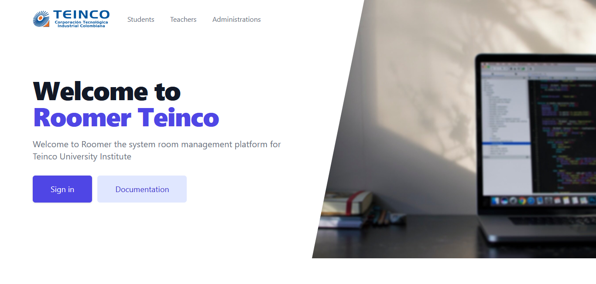

[](https://github.com/MerlonProgramming/MerlonProgramming/blob/main/)

<h1 align="center">
  Roomer Teinco
</h1>

<p align="center">

<p align="center">
<a href="https://www.buymeacoffee.com/rahuldkjain" target="_blank">
</p>

#### Tired of editing GitHub Profile README with new features?

Development of a web interface for the registration of rooms in Teinco.

## Features

Just fill in the details such as Form Cars with adobe XD.

## Installation Steps

1. Clone the repository

```bash
git clone
```

2. Change the working directory

```bash
cd
```

3. Install dependencies

```bash
node and npm ( npm install )
```

4. Run the app

```bash
is a template (with a server or open the html)
```

You are all set!

## Contributing

[](https://github.com/MerlonProgramming/MerlonProgramming/blob/main/)

## Built with

- [Tailwind CSS](https://tailwindcss.com/): for styling

## Sponsors

- [Sebastian Hurtado]() The best contributed
- [Jefferson Ocampo]() Contributed for the Database
- [Marlon S. Diaz Lopez]() I am Contribute with the code

## Support

<p align="left">
  <a href='https://ko-fi.com/A0A81XXSX' target='_blank'>
  </a>
  <a href="https://www.buymeacoffee.com/rahuldkjain" target="_blank">
</p>

<hr>
<p align="center">
Teinco
</p>
